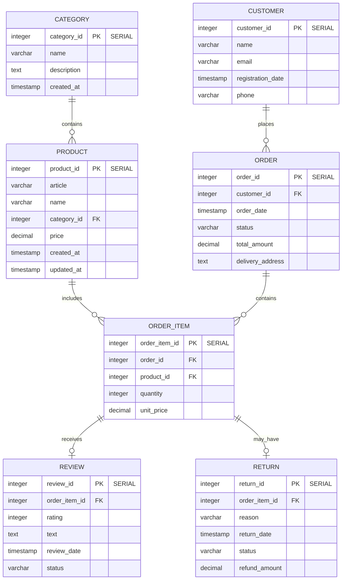
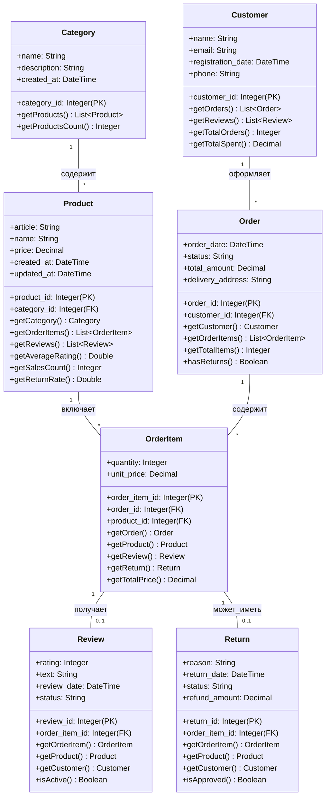
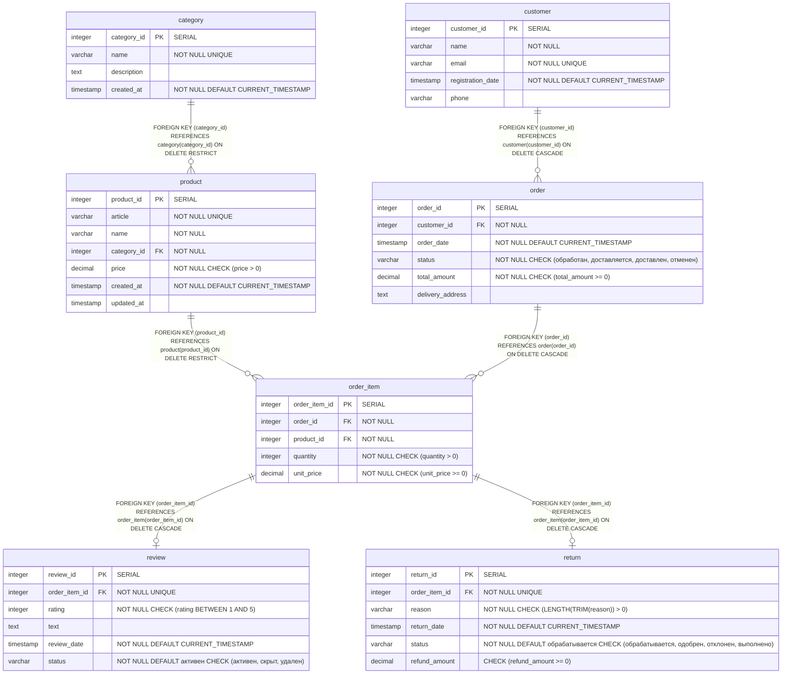

**Лабораторные работы по Базам Данных**

Выполнил: Васильев Владислав Ильич(2261-ДБ)  
Telegram: @VIad_OS

# Постановка задачи (вариант 46)

**Интернет-магазин: анализ отзывов и возвратов**

*Сущности:* 
  - Товары (артикул, категория),
  - Заказы (номер, дата), 
  - Отзывы (оценка от 1 до 5, текст, дата),
  - Возвраты (причина, дата)

*Процессы:*
  - После получения заказа клиент может оставить отзыв или инициировать возврат товара.

*Выходные документы:*
  - Выдать рейтинг товаров заданной категории по средней оценке, но исключив товары с количеством отзывов менее 10. Отсортировать по убыванию рейтинга.
  - Выдать список товаров с процентом возвратов от общего количества покупок за квартал, отсортированный по убыванию процента (только товары с более чем 50 покупками).

# Лабораторная работа №1 (Проектирование логической и физической модели БД)

```text
Лаба по проектированию информационной модели для реляционных баз данных.
Предполагаем Postgresql. 

# Интернет-магазин: анализ отзывов и возвратов

## Постановка задачи

*Сущности:*
    Товары (артикул, категория),
    Заказы (номер, дата),
    Отзывы (оценка от 1 до 5, текст, дата),
    Возвраты (причина, дата).

*Процессы:*
    После получения заказа клиент может оставить отзыв или инициировать возврат товара.

*Выходные документы:*

  - Выдать рейтинг товаров заданной категории по средней оценке, но исключив товары с количеством отзывов менее 10. Отсортировать по убыванию рейтинга.

  - Выдать список товаров с процентом возвратов от общего количества покупок за квартал, отсортированный по убыванию процента (только товары с более чем 50 покупками).

## ER-Модель

### Базовые сущности

    Товар(артикул, название, категория, цена)
    Заказ(номер, дата, статус)
    Отзыв(оценка, текст, дата)
    Возврат(причина, дата, статус)
    Клиент(идентификатор, имя, email)

### Отношения

    [Клиент]-1,Required------------------0..N,Optional-[Заказ]
    [Заказ]-1,Required------------------1..N,Required-[ПозицияЗаказа]
    [Товар]-1,Required------------------0..N,Optional-[ПозицияЗаказа]
    [Товар]-1,Required------------------0..N,Optional-[Отзыв]
    [Клиент]-1,Required------------------0..N,Optional-[Отзыв]
    [ПозицияЗаказа]-1,Optional------------------0..1,Optional-[Возврат]

## Логическая модель

Получаем шесть таблиц:

  - ```Product(article, name, category, price)```, primary key - article
  - ```Customer(customer_id, name, email, registration_date)```, primary key - customer_id
  - ```Order(order_id, customer_id, order_date, status)```, primary key - order_id
  - ```OrderItem(order_item_id, order_id, product_article, quantity, unit_price)```, primary key - order_item_id
  - ```Review(review_id, product_article, customer_id, rating, text, review_date)```, primary key - review_id
  - ```Return(return_id, order_item_id, reason, return_date, status)```, primary key - return_id

## Физическая модель

Зададим типы данных для атрибутов:

  - ```article::varchar(50)```
  - ```name::varchar(200)```
  - ```category::varchar(100)```
  - ```price::decimal(10,2)```
  - ```customer_id::serial```
  - ```name::varchar(100)```
  - ```email::varchar(150)```
  - ```registration_date::timestamp```
  - ```order_id::serial```
  - ```customer_id::integer```
  - ```order_date::timestamp```
  - ```status::varchar(20)``` CHECK (status IN ('обработан', 'доставляется', 'доставлен', 'отменен'))
  - ```order_item_id::serial```
  - ```order_id::integer```
  - ```product_article::varchar(50)```
  - ```quantity::integer```
  - ```unit_price::decimal(10,2)```
  - ```review_id::serial```
  - ```product_article::varchar(50)```
  - ```customer_id::integer```
  - ```rating::integer``` CHECK (rating BETWEEN 1 AND 5)
  - ```text::text```
  - ```review_date::timestamp```
  - ```return_id::serial```
  - ```order_item_id::integer```
  - ```reason::varchar(500)```
  - ```return_date::timestamp```
  - ```status::varchar(20)``` CHECK (status IN ('обрабатывается', 'одобрен', 'отклонен', 'выполнен'))```
  ```

## Ответ DeepSeek

Отличная основа для интернет-магазина! Модель хорошо отражает бизнес-процессы, но есть несколько важных улучшений для создания более надежной и нормализованной базы данных.

### Критические замечания и рекомендации

### 1. Нормализация товаров и категорий
**Проблема:**  Категория хранится непосредственно в таблице товаров, что приводит к избыточности данных.
**Исправление:** Создаем отдельную сущность "Категории" для централизованного управления.


#### 2. Улучшение структуры заказов
**Проблема:** Отсутствует связь между отзывами/возвратами и конкретными позициями заказа.
**Исправление:** Связываем отзывы и возвраты с позициями заказа, а не напрямую с товарами.

#### 3. Добавление проверок целостности
**Проблема:** Недостаточно ограничений для обеспечения бизнес-логики.
**Исправление:** Добавляем CHECK-ограничения для рейтингов, дат и статусов.

### Исправленная и улучшенная модель

#### Логическая модель
*   **`Category`** (`category_id`, name, description)
*   **`Product`** (`product_id`, article, name, category_id, price)
*   **`Customer`** (`customer_id`, name, email, registration_date)
*   **`Order`** (`order_id`, customer_id, order_date, status, total_amount)
*   **`OrderItem`** (`order_item_id`, order_id, product_id, quantity, unit_price)
*   **`Review`** (`review_id`, order_item_id, rating, text, review_date, status)
*   **`Return`** (`return_id`, order_item_id, reason, return_date, status, refund_amount)

#### Физическая модель (DDL для PostgreSQL)
```sql
-- Таблица категорий
CREATE TABLE category (
    category_id SERIAL PRIMARY KEY,
    name VARCHAR(100) NOT NULL UNIQUE,
    description TEXT,
    created_at TIMESTAMP NOT NULL DEFAULT CURRENT_TIMESTAMP
);

-- Таблица товаров
CREATE TABLE product (
    product_id SERIAL PRIMARY KEY,
    article VARCHAR(50) NOT NULL UNIQUE,
    name VARCHAR(200) NOT NULL,
    category_id INTEGER NOT NULL REFERENCES category(category_id) ON DELETE RESTRICT,
    price DECIMAL(10,2) NOT NULL CHECK (price > 0),
    created_at TIMESTAMP NOT NULL DEFAULT CURRENT_TIMESTAMP,
    updated_at TIMESTAMP
);

-- Таблица клиентов
CREATE TABLE customer (
    customer_id SERIAL PRIMARY KEY,
    name VARCHAR(100) NOT NULL,
    email VARCHAR(150) NOT NULL UNIQUE,
    registration_date TIMESTAMP NOT NULL DEFAULT CURRENT_TIMESTAMP,
    phone VARCHAR(20)
);

-- Таблица заказов
CREATE TABLE "order" (
    order_id SERIAL PRIMARY KEY,
    customer_id INTEGER NOT NULL REFERENCES customer(customer_id) ON DELETE CASCADE,
    order_date TIMESTAMP NOT NULL DEFAULT CURRENT_TIMESTAMP,
    status VARCHAR(20) NOT NULL CHECK (status IN ('обработан', 'доставляется', 'доставлен', 'отменен')),
    total_amount DECIMAL(10,2) NOT NULL CHECK (total_amount >= 0),
    delivery_address TEXT
);

-- Таблица позиций заказа
CREATE TABLE order_item (
    order_item_id SERIAL PRIMARY KEY,
    order_id INTEGER NOT NULL REFERENCES "order"(order_id) ON DELETE CASCADE,
    product_id INTEGER NOT NULL REFERENCES product(product_id) ON DELETE RESTRICT,
    quantity INTEGER NOT NULL CHECK (quantity > 0),
    unit_price DECIMAL(10,2) NOT NULL CHECK (unit_price >= 0),
    -- Проверка, что цена позиции равна количеству * цену за единицу
    CHECK (unit_price * quantity >= 0)
);

-- Таблица отзывов
CREATE TABLE review (
    review_id SERIAL PRIMARY KEY,
    order_item_id INTEGER NOT NULL UNIQUE REFERENCES order_item(order_item_id) ON DELETE CASCADE,
    rating INTEGER NOT NULL CHECK (rating BETWEEN 1 AND 5),
    text TEXT,
    review_date TIMESTAMP NOT NULL DEFAULT CURRENT_TIMESTAMP,
    status VARCHAR(20) NOT NULL DEFAULT 'активен' CHECK (status IN ('активен', 'скрыт', 'удален')),
    -- Проверка, что текст отзыва не пустой, если предоставлен
    CHECK (text IS NULL OR LENGTH(TRIM(text)) > 0)
);

-- Таблица возвратов
CREATE TABLE return (
    return_id SERIAL PRIMARY KEY,
    order_item_id INTEGER NOT NULL UNIQUE REFERENCES order_item(order_item_id) ON DELETE CASCADE,
    reason VARCHAR(500) NOT NULL,
    return_date TIMESTAMP NOT NULL DEFAULT CURRENT_TIMESTAMP,
    status VARCHAR(20) NOT NULL DEFAULT 'обрабатывается' CHECK (status IN ('обрабатывается', 'одобрен', 'отклонен', 'выполнен')),
    refund_amount DECIMAL(10,2) CHECK (refund_amount >= 0),
    -- Проверка, что причина возврата не пустая
    CHECK (LENGTH(TRIM(reason)) > 0)
);

-- Индексы для оптимизации частых запросов
CREATE INDEX idx_product_category ON product(category_id);
CREATE INDEX idx_product_article ON product(article);
CREATE INDEX idx_order_customer_date ON "order"(customer_id, order_date);
CREATE INDEX idx_order_date ON "order"(order_date);
CREATE INDEX idx_order_status ON "order"(status);
CREATE INDEX idx_order_item_product ON order_item(product_id);
CREATE INDEX idx_order_item_order ON order_item(order_id);
CREATE INDEX idx_review_rating_date ON review(rating, review_date);
CREATE INDEX idx_review_order_item ON review(order_item_id);
CREATE INDEX idx_return_date_status ON return(return_date, status);
CREATE INDEX idx_return_order_item ON return(order_item_id);
CREATE INDEX idx_customer_email ON customer(email);
```

#### Проверка нормальных форм
*   **1NF:** Соблюдена - все значения атомарные
*   **2NF:** Соблюдена - нет зависимостей неключевых атрибутов от части ключа
*   **3NF/BCNF:** Соблюдена - нет транзитивных зависимостей, все неключевые атрибуты зависят только от ключа

---

### Примеры запросов для "Выходных документов"

**1. Рейтинг товаров заданной категории по средней оценке (отзывов ≥ 10):**
```sql
SELECT 
    p.product_id,
    p.article,
    p.name,
    c.name as category_name,
    ROUND(AVG(r.rating)::numeric, 2) as avg_rating,
    COUNT(r.review_id) as review_count
FROM product p
JOIN category c ON p.category_id = c.category_id
JOIN order_item oi ON p.product_id = oi.product_id
JOIN review r ON oi.order_item_id = r.order_item_id
WHERE c.name = 'Название_категории'  -- Заменить на нужную категорию
    AND r.status = 'активен'
GROUP BY p.product_id, p.article, p.name, c.name
HAVING COUNT(r.review_id) >= 10
ORDER BY avg_rating DESC;
```

**2. Товары с процентом возвратов за квартал (покупок > 50):**
```sql
WITH quarterly_stats AS (
    SELECT 
        p.product_id,
        p.article,
        p.name,
        COUNT(DISTINCT oi.order_item_id) as total_purchases,
        COUNT(DISTINCT ret.return_id) as total_returns,
        ROUND(
            (COUNT(DISTINCT ret.return_id) * 100.0 / NULLIF(COUNT(DISTINCT oi.order_item_id), 0))::numeric, 
            2
        ) as return_percentage
    FROM product p
    JOIN order_item oi ON p.product_id = oi.product_id
    JOIN "order" o ON oi.order_id = o.order_id
    LEFT JOIN return ret ON oi.order_item_id = ret.order_item_id 
        AND ret.return_date >= DATE_TRUNC('quarter', CURRENT_DATE)
        AND ret.status IN ('одобрен', 'выполнен')
    WHERE o.order_date >= DATE_TRUNC('quarter', CURRENT_DATE)
        AND o.status IN ('доставлен')
    GROUP BY p.product_id, p.article, p.name
    HAVING COUNT(DISTINCT oi.order_item_id) > 50
)
SELECT 
    product_id,
    article,
    name,
    total_purchases,
    total_returns,
    return_percentage
FROM quarterly_stats
ORDER BY return_percentage DESC;
```

**Дополнительный полезный запрос - статистика по категориям:**
```sql
SELECT 
    c.name as category_name,
    COUNT(DISTINCT p.product_id) as product_count,
    COUNT(DISTINCT oi.order_item_id) as total_sales,
    ROUND(AVG(r.rating)::numeric, 2) as avg_rating,
    COUNT(DISTINCT ret.return_id) as total_returns
FROM category c
LEFT JOIN product p ON c.category_id = p.category_id
LEFT JOIN order_item oi ON p.product_id = oi.product_id
LEFT JOIN review r ON oi.order_item_id = r.order_item_id AND r.status = 'активен'
LEFT JOIN return ret ON oi.order_item_id = ret.return_id
GROUP BY c.category_id, c.name
ORDER BY total_sales DESC;
```

## Полученные диаграммы:

### ER-диаграмма



## Логическая модель в виде Диаграммы классов UML



## Физическая модель БД



## Заключение

В лабораторной работе произведено проектирование ER-, логической и физической модели базы данных для интернет-магазина (вариант 46). Основные улучшения, внесенные в ходе проектирования:

1. **Нормализация категорий** - создана отдельная сущность "Категории" для устранения избыточности данных
2. **Улучшенная структура связей** - отзывы и возвраты теперь связаны с позициями заказа, что отражает реальную бизнес-логику
3. **Суррогатные ключи** - добавлены числовые идентификаторы для эффективности соединений
4. **Расширенная валидация** - добавлены CHECK-ограничения для рейтингов, цен, количеств и статусов
5. **Бизнес-логика** - реализованы уникальные ограничения для предотвращения дублирования отзывов и возвратов
6. **Оптимизация производительности** - созданы индексы для частых запросов по датам, категориям и статусам
7. **Соблюдение нормальных форм** - модель соответствует требованиям 3NF/BCNF

Модель эффективно поддерживает все требуемые бизнес-процессы и выходные документы, обеспечивая надежное хранение данных, целостность отношений и высокую производительность аналитических запросов по отзывам и возвратам.


# Лабораторная работа №2 (Инсталляция БД на сервере)
## Создание DDL-запросов для PostgreSQL
## Создание таблиц

### Таблица category(категорий)


### Таблица customer(клиентов)


### Таблица product(товаров)


### Таблица order(заказов)


### Таблица order_item(позиций заказа)


### Таблица review(отзывов)


### Таблица return(возвратов)


## Создание индексов


## Заполнение данными

### Таблица category


### Таблица customer


### Таблица product


### Таблица order


### Таблица order_item


### Таблица review


### Таблица return


## Запросы

### Запрос 1. Клиенты и их заказы


### Запрос 2. Статистика по категориям 


