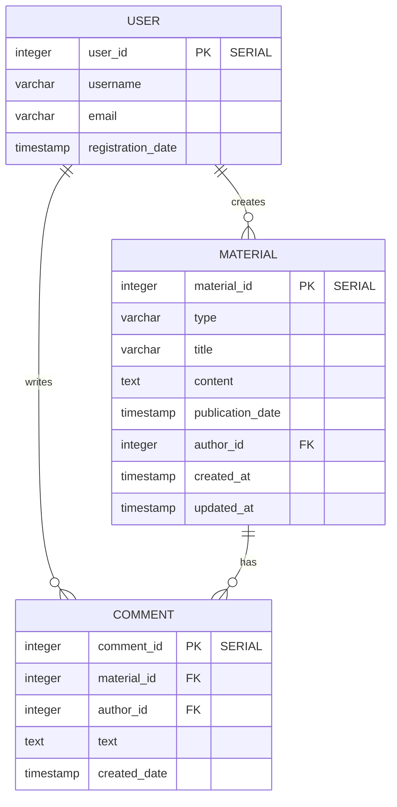

**Лабораторные работы по Базам Данных**

Перечень [вариантов лабораторнях работ](https://edu.irnok.net/doku.php?id=db:nn_tasks)

Telegram: @VIad_OC

# Постановка задачи (вариант 59)

**Управление контентом веб-сайта (CMS)**

*Сущности:* 
  - Страницы (URL, заголовок),
  - Материалы (тип — статья/новость, дата публикации, автор), 
  - Комментарии (дата, автор комментария, текст)

*Процессы:*
  - Публикуются материалы.
  - Пользователи оставляют комментарии к материалам.
*Выходные документы:*
  - Выдать список самых популярных зон парковки для начала поездок за указанный период, отсортированный по количеству поездок.
  - Для заданного клиента выдать историю всех поездок с указанием стоимости и пробега, отсортированную по дате поездки.

# Лабораторная работа №1 (Проектирование логической и физической модели БД)

## Промпт к DeepSeek

```text
Лаба по проектированию информационной модели для реляционных баз данных.
Предполагаем Postgresql. 
Есть ошибки, замечания, неточности?

# Система каршеринга (аренды автомобилей по минутам)

## Постановка задачи

*Сущности:*
    Страницы (URL, заголовок),
    Материалы (тип - статья/новость, дата публикации, автор),
    Комментарии (дата, автор комментария, текст).

*Процессы:*
    Публикуются материалы,
    Пользователи оставляют комментарии к материалам.

*Выходные документы:*

  - Выдать список самых комментируемых материалов за последний месяц, отсортированный по убыванию количества комментариев.

  - Выдать "активность" авторов: количество опубликованных материалов за квартал, отсортированное по убыванию количества.

## ER-Модель

### Базовые сущности

    Страница(url, заголовок)
    Материал(тип, дата_публикации, автор, заголовок, текст)
    Комментарий(дата, автор_комментария, текст)

### Отношения

    [Страница]-1,Optional------------------0..N,Optional-[Материал]
    [Материал]-1,Required------------------0..N,Optional-[Комментарий]

## Логическая модель

Получаем три таблицы:

  - ```Page(url, title)```, primary key - url
  - ```Material(material_id, page_url, type, publication_date, author, title, content)```, primary key - material_id
  - ```Comment(comment_id, material_id, author, text, created_date)```, primary key - comment_id

## Физическая модель

Зададим типы данных для атрибутов:

  - ```url::varchar(500)```
  - ```title::varchar(200)```
  - ```material_id::serial```
  - ```page_url::varchar(500)```
  - ```type::varchar(20)``` CHECK (type IN ('статья', 'новость'))
  - ```publication_date::timestamp```
  - ```author::varchar(100)```
  - ```content::text```
  - ```comment_id::serial```
  - ```material_id::integer```
  - ```author::varchar(100)```
  - ```text::text```
  - ```created_date::timestamp```
```

## Ответ DeepSeek

Отличная основа! Модель в целом отражает бизнес-процессы CMS, но есть несколько критических улучшений для создания более надежной и нормализованной базы данных.

### Критические замечания и рекомендации

#### 1. Избыточность сущности "Страницы"
**Проблема:**  Сущность "Страницы" не участвует напрямую в ключевых процессах (публикация материалов и комментарии). В требованиях к выходным документам она не упоминается.

**Исправление:** Исключаем сущность "Страницы" из основной модели, чтобы избежать избыточности и упростить схему.
```

#### 2. Отсутствие суррогатных ключей
**Проблема:** Использование длинных строковых полей в качестве первичных ключей неэффективно для соединений и индексов.
**Исправление:** Добавляем суррогатные числовые ключи для всех основных сущностей.

#### 3. Нормализация авторов
**Проблема:** Авторы материалов и комментариев хранятся как простой текст, что приводит к избыточности данных и потенциальным несоответствиям.
**Исправление:** Создаем отдельную сущность "Пользователи" для централизованного управления авторами.

### Исправленная и улучшенная модель

#### Логическая модель
*   **`User`** (`user_id`, username, email, registration_date)
*   **`Material`** (`material_id`, type, title, content, publication_date, author_id)
*   **`Comment`** (`comment_id`, material_id, author_id, text, created_date)

#### Физическая модель (DDL для PostgreSQL)
```sql
-- Таблица пользователей (авторов)
CREATE TABLE "user" (
    user_id SERIAL PRIMARY KEY,
    username VARCHAR(50) NOT NULL UNIQUE,
    email VARCHAR(100) NOT NULL UNIQUE,
    registration_date TIMESTAMP NOT NULL DEFAULT CURRENT_TIMESTAMP
);

-- Таблица материалов
CREATE TABLE material (
    material_id SERIAL PRIMARY KEY,
    type VARCHAR(20) NOT NULL CHECK (type IN ('статья', 'новость')),
    title VARCHAR(255) NOT NULL,
    content TEXT,
    publication_date TIMESTAMP NOT NULL DEFAULT CURRENT_TIMESTAMP,
    author_id INTEGER NOT NULL REFERENCES "user"(user_id) ON DELETE CASCADE,
    created_at TIMESTAMP NOT NULL DEFAULT CURRENT_TIMESTAMP,
    updated_at TIMESTAMP
);

-- Таблица комментариев
CREATE TABLE comment (
    comment_id SERIAL PRIMARY KEY,
    material_id INTEGER NOT NULL REFERENCES material(material_id) ON DELETE CASCADE,
    author_id INTEGER NOT NULL REFERENCES "user"(user_id) ON DELETE CASCADE,
    text TEXT NOT NULL,
    created_date TIMESTAMP NOT NULL DEFAULT CURRENT_TIMESTAMP,
    -- Проверка, что комментарий не пустой
    CHECK (LENGTH(TRIM(text)) > 0)
);

-- Индексы для оптимизации частых запросов
CREATE INDEX idx_material_publication_date ON material(publication_date);
CREATE INDEX idx_material_author_date ON material(author_id, publication_date);
CREATE INDEX idx_comment_created_date ON comment(created_date);
CREATE INDEX idx_comment_material_id ON comment(material_id);
CREATE INDEX idx_comment_author_date ON comment(author_id, created_date);
CREATE INDEX idx_user_username ON "user"(username);
```

#### Проверка нормальных форм
*   **1NF:** Соблюдена - все значения атомарные
*   **2NF:** Соблюдена - нет зависимостей неключевых атрибутов от части ключа
*   **3NF/BCNF:** Соблюдена - нет транзитивных зависимостей, все неключевые атрибуты зависят только от ключа

---

### Примеры запросов для "Выходных документов"

**1. Самые комментируемые материалы за последний месяц:**
```sql
SELECT 
    m.material_id,
    m.title,
    m.type,
    u.username as author_name,
    COUNT(c.comment_id) as comment_count
FROM material m
JOIN "user" u ON m.author_id = u.user_id
LEFT JOIN comment c ON m.material_id = c.material_id 
    AND c.created_date >= CURRENT_DATE - INTERVAL '1 month'
    AND c.created_date < CURRENT_DATE
GROUP BY m.material_id, m.title, m.type, u.username
ORDER BY comment_count DESC
LIMIT 10;
```

**2. Активность авторов за квартал:**
```sql
SELECT 
    u.user_id,
    u.username,
    COUNT(m.material_id) as materials_count
FROM "user" u
JOIN material m ON u.user_id = m.author_id
WHERE m.publication_date >= DATE_TRUNC('quarter', CURRENT_DATE)
GROUP BY u.user_id, u.username
ORDER BY materials_count DESC;
```

**Дополнительный полезный запрос - статистика комментариев по авторам:**
```sql
SELECT 
    u.username,
    COUNT(c.comment_id) as total_comments,
    COUNT(DISTINCT c.material_id) as commented_materials
FROM "user" u
JOIN comment c ON u.user_id = c.author_id
GROUP BY u.user_id, u.username
ORDER BY total_comments DESC;
```

## Полученные диаграммы:

### ER-диаграмма



## Логическая модель в виде Диаграммы классов UML


## Физическая модель БД


## Заключение

В лабораторной работе произведено проектирование ER-, логической и физической модели базы данных для системы управления контентом (CMS, вариант 59). Основные улучшения, внесенные в ходе проектирования:

1. **Устранение избыточности** - исключена неиспользуемая сущность "Страницы"
2. **Нормализация данных** -  создана отдельная сущность "Пользователи" для управления авторами
3. **Суррогатные ключи** - заменены текстовые идентификаторы на числовые для эффективности
4. **Валидация данных** - добавлены CHECK-ограничения для типов материалов и непустых комментариев
5. **Оптимизация производительности** - созданы индексы для частых запросов по датам и авторам
6. **Соблюдение нормальных форм** - модель соответствует требованиям 3NF/BCNF

Модель эффективно поддерживает все требуемые бизнес-процессы и выходные документы, обеспечивая надежное хранение данных, целостность отношений и высокую производительность запросов.
